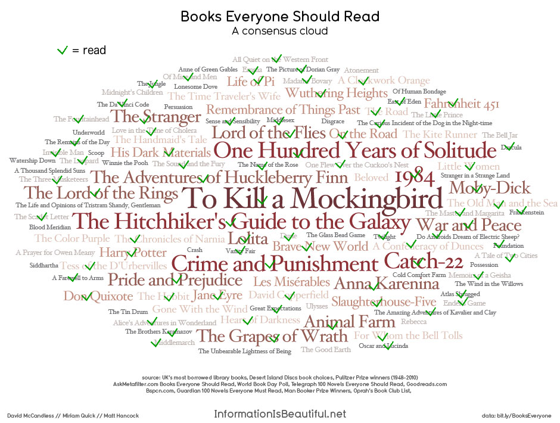

# List of random book ideas

## Prizes
- [Nebula Awards](https://en.wikipedia.org/wiki/Nebula_Award_for_Best_Novel)
- Hugo Awards: [Best Novel](https://en.wikipedia.org/wiki/Hugo_Award_for_Best_Novel), [Best Graphic Novel](https://en.wikipedia.org/wiki/Hugo_Award_for_Best_Graphic_Story)
- [World Fantasy Awards](https://en.wikipedia.org/wiki/World_Fantasy_Award—Novel)
- [Locus Award](https://en.wikipedia.org/wiki/Locus_Award_for_Best_Fantasy_Novel)
- [Man Booker Prize](https://en.wikipedia.org/wiki/List_of_winners_and_shortlisted_authors_of_the_Booker_Prize_for_Fiction)
- [Pulitzer Prize for Fiction](https://en.wikipedia.org/wiki/Pulitzer_Prize_for_Fiction)
- Eisner Award: [Best Continuing Series](https://en.wikipedia.org/wiki/List_of_Eisner_Award_winners#Best_Continuing_Series)

## Lists
- [Francine Prose](http://www.giraffedays.com?page_id=5899)
- [Powells, Portland](http://www.powells.com/staff-picks)
- [NPR best SciFi and Fantasy (2011)](https://www.npr.org/2011/08/11/139085843/your-picks-top-100-science-fiction-fantasy-books)
- [NPR best SciFi and Fantasy of last decade](https://www.npr.org/2021/08/18/1027159166/best-books-science-fiction-fantasy-past-decade)

## Consensus cloud

## Series to be continued
Author | Series name | Next book
:------ |:------ |:------
Joe Abercrombie | Age of Madness |
Seth Dickinson | Masquerade |
James Edward Gordon | | Structures
Mick Herron | The Slough House | Spook Street
Marlon James | | White Wing, Dark Star
N. K. Jemisin | |
Robert Jordan | A Wheel of Time |
Steven King | The Dark Tower | The Drawing of the Three
Fonda Lee | Green Bones Saga | Jade Legacy
G.R.R. Martin | A Song of Ice and Fire | |
Arkady Martine | Teixcalaan series |
Kim Stanley Robinson | Mars trilogy | Green Mars
Brian Sanderson | Mistborn | The Alloy of Law
V. E. Schwab | Shades of Magic | A Conjuring of Light

## Other
Author | Title
:------ |:------
Terry Pratchett |
David Denby | Great Books
Robert Heinlein |
H.P Lovecraft |
Gabriel Garcia Marquez |
Proust |
Thoreau |
Baudelaire | Les Fleurs du Mal
Joyce |
Camus |
Nietzsche |
Henry James |
Voltaire |
Alexander Pope |
Oscar Wilde |
Kipling |
H.G Wells |
E.A. Poe |
Ralph Waldo Emerson |
Moliere |
Malraux |
Sartre |
Fleming |
P.G Wodehouse |
Turgenev |
Maupassant |
Hawthorne |
Austen | got Emma, PnP, SnS
Smollet | Humphrey Clinker
Smollet | Peregrine Pickle
